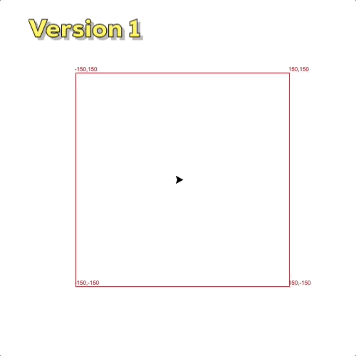
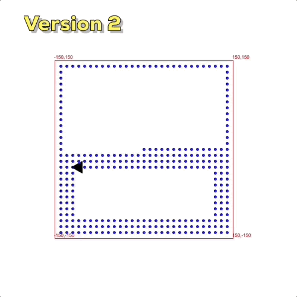
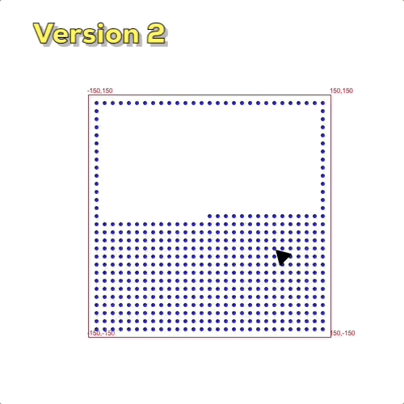
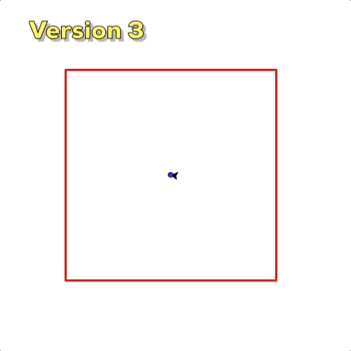
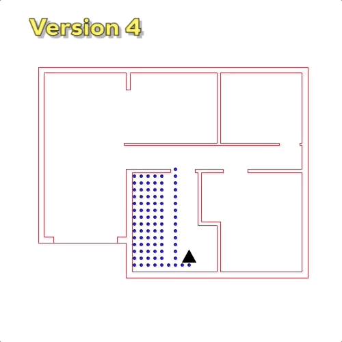
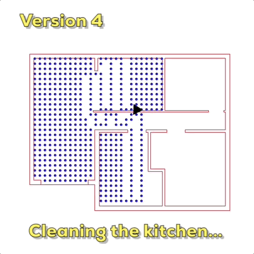
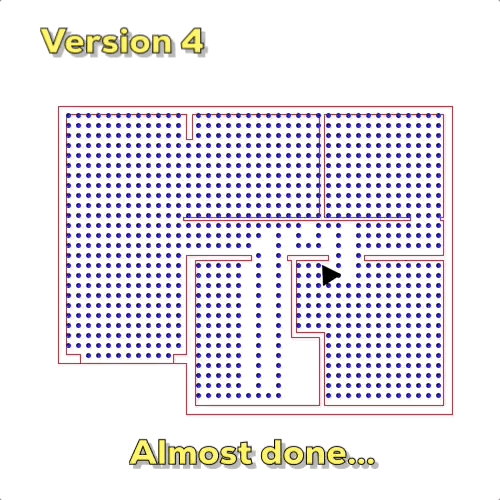

# Robot v1
Figuring out the correct algorithm of how to cover the entire room.

# Robot v2
Implementing the depth-first search (dfs) algorithm.

# Robot v3
Implementing the iterative dfs.
Cancel changes

# Robot v4
Trying out the final algorithm in a real landscape.

