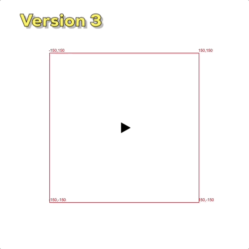

# Robot v1
Figuring out the correct algorithm of how to cover the entire room. The robot is not able to clean the room, but it avoids moving outside of the walls.

# Robot v2
Implementing the depth-first search (dfs) algorithm. The robot is able to clean the entire room, but it makes to many parasitic moves in order to exit the recursions.

# Robot v3
Implementing the iterative dfs. The robot cleans the room and, since we use the loop instead of the recursion, it avoids making this parasitic moves.

# Robot v4
Testing the final algorithm in a real landscape. Perfect!!!

